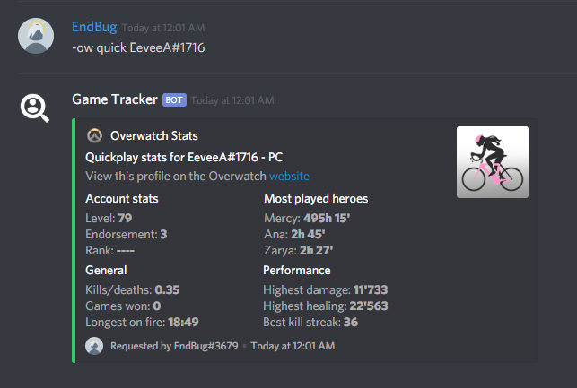
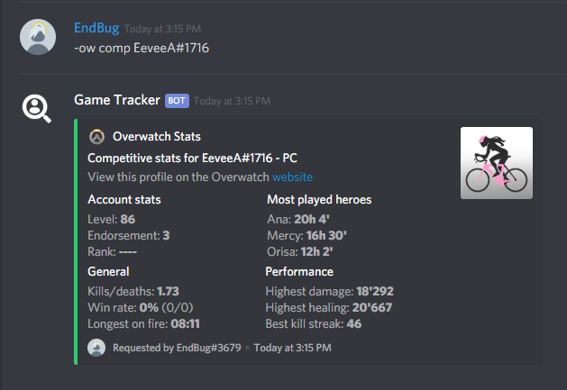

# Overwatch
The Overawatch commands let you look up players from every platform and get their stats.

## Index
These are the current commands:  
* [`ow quick`](#ow-quick)
* [`ow comp`](#ow-comp)
* [`ow hero`](#ow-hero)
* [`ow herocomp`](#ow-herocomp)
* [`ow link`](#ow-link)
* [`ow unlink`](#ow-unlink)

## Format guide
`<>` is for mandatory, `[]` is for optional, `{}` is for mandatory if not linked.

### Custom definitions
* `{account}` → the account you want to look for; it could be either a BattleTag, a GamerTag or a PSN ID, depending on the platform. If the user you want to look up has [linked](#ow-link) their account you can replace this with a Discord `@mention`. If you [linked](#ow-link) your account and you want to see your stats leave this blank, the bot will automatically use your linked account.
* `[platform]` → the platform the account belongs to; it could be either `pc`, `xbl` or `psn`. If you leave this blank, the bot will automatically use `pc` as the default. If you use a linked profile, whether for another user or yourself, you can leave this blank.

# Commands

### `ow quick`

Displays quickplay stats for the targeted user.  
This is the default command: that means that running `ow` by itself will trigger `ow quick`.

Format: `ow quick {account} [platform]`

To specify the player, enter their battletag/GamerTag/PSN ID. You can also mention them and, if they linked their account to this bot, it will display their stats. If left blank, the bot will try to show your profile (if you [linked](#ow-link) it).

Examples:  
* `ow quick EeveeA#1716` → Displays quickplay stats for `EeveeA#1716` by searching them in the PC category.
* `ow quick FANKDA psn` → Displays quickplay stats for `FANKDA` by searching them in the PlayStation Network.
* `ow quick @YoMama` → Displays quickplay stats for the mentioned user, if their account is linked.
* `ow quick` → If your account is linked, displays your quickplay Overwatch stats.

Image (click here to show)
  

### `ow comp`

Displays competitive stats for the targeted user.

Format: `ow comp {account} [platform]`

To specify the player, enter their battletag/GamerTag/PSN ID. You can also mention them and, if they linked their account to this bot, it will display their stats. If left blank, the bot will try to show your profile (if you [linked](#ow-link) it).

Examples:
* `ow comp EeveeA#1716` → Displays competitive stats for `EeveeA#1716` by searching them in the PC category.
* `ow comp FANKDA psn` → Displays competitive stats for `FANKDA` by searching them in the PlayStation Network.
* `ow comp @YoMama` → Displays competitive stats for the mentioned user, if their account is linked.
* `ow comp` → If your account is linked, displays your competitive Overwatch stats.

Image (click here to show)
  

