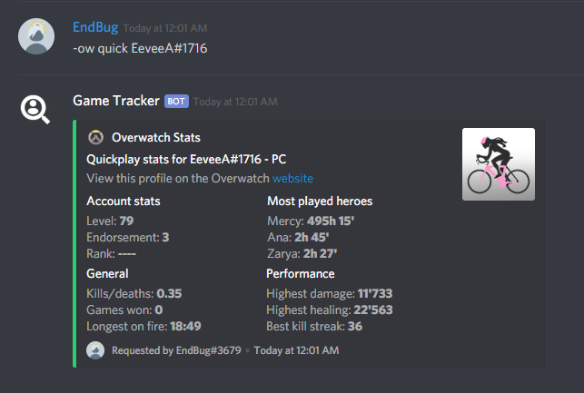
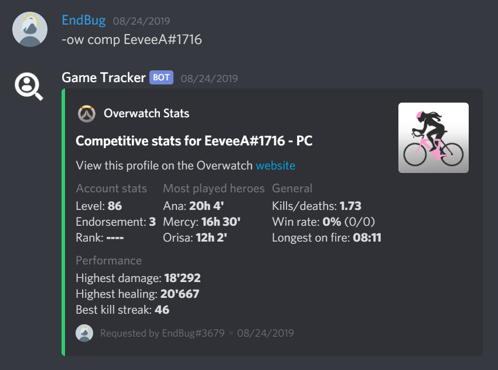
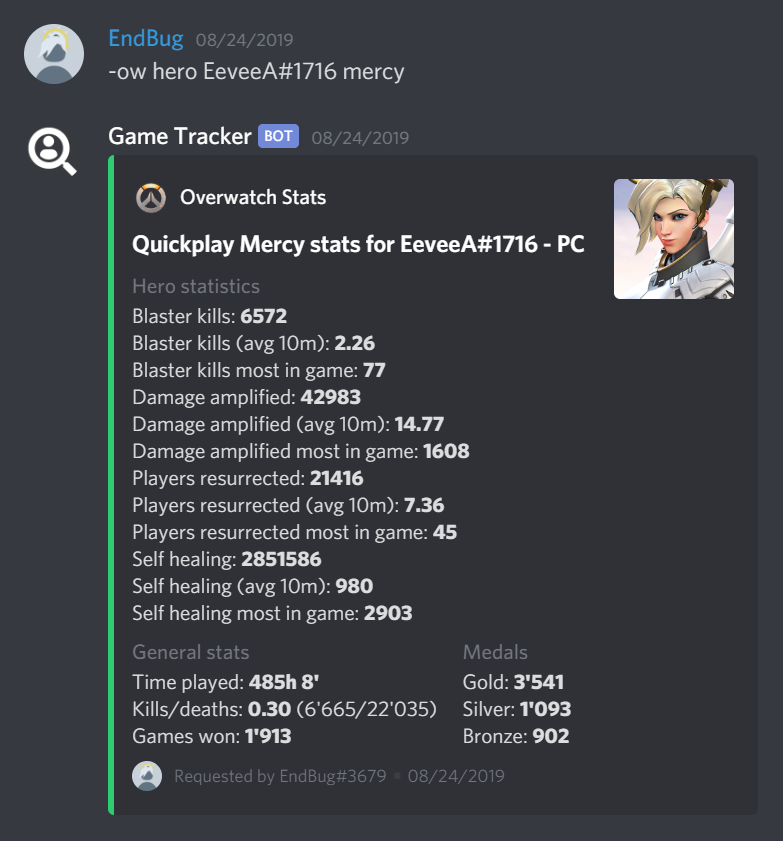
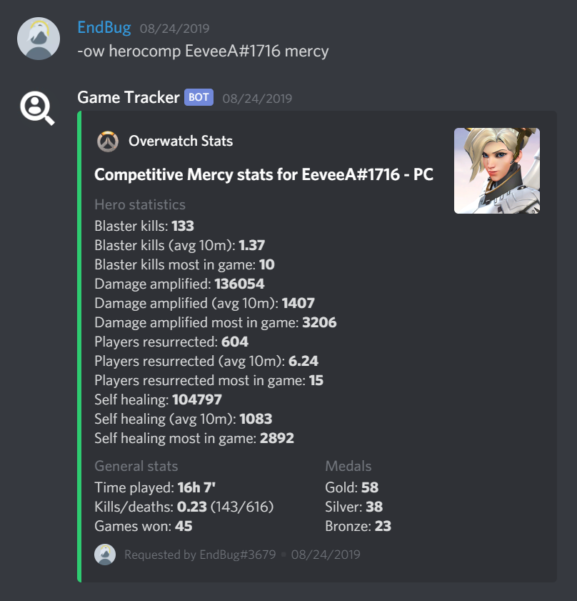

# Overwatch

The Overwatch commands let you look up players from every platform and get their stats.

## Format guide

`<>` is for mandatory, `[]` is for optional, `{}` is for mandatory if not linked.

### Custom definitions

- `account` → the account you want to look for; it could be either a BattleTag, a GamerTag or a PSN ID, depending on the platform. If the user you want to look up has [linked](#ow-link) their account you can replace this with a Discord `@mention`. If you [linked](#ow-link) your account and you want to see your stats leave this blank, the bot will automatically use your linked account.
- `platform` → the platform the account belongs to; it could be either `pc`, `xbl` or `psn`. If you leave this blank, the bot will automatically use `pc` as the default. If you use a linked profile, whether for another user or yourself, you can leave this blank.
- `hero` → the hero you want to see stats for; it usually corresponds to the English name of the hero in lowercase, but you can check the [hero table](/ow/ow_heroes.md) to be sure (names in other languages and nicknames are also supported).

## Commands

### `ow quick`

_Displays quickplay stats for the targeted user._  
This is the default command: that means that running `ow` by itself will trigger `ow quick`.

> Format: `ow quick {account} [platform]`

To specify the player, enter their battletag/GamerTag/PSN ID. You can also mention them and, if they linked their account to this bot, it will display their stats. If left blank, the bot will try to show your profile (if you [linked](#ow-link) it).

Examples:

- `ow quick EeveeA#1716` → Displays quickplay stats for `EeveeA#1716` by searching them in the PC category.
- `ow quick FANKDA psn` → Displays quickplay stats for `FANKDA` by searching them in the PlayStation Network.
- `ow quick @DiscordUser` → Displays quickplay stats for the mentioned user, if their account is linked.
- `ow quick` → If your account is linked, displays your quickplay Overwatch stats.

📷 Image (click here to show)

### `ow comp`

_Displays competitive stats for the targeted user._

> Format: `ow comp {account} [platform]`

To specify the player, enter their battletag/GamerTag/PSN ID. You can also mention them and, if they linked their account to this bot, it will display their stats. If left blank, the bot will try to show your profile (if you [linked](#ow-link) it).

Examples:

- `ow comp EeveeA#1716` → Displays competitive stats for `EeveeA#1716` by searching them in the PC category.
- `ow comp FANKDA psn` → Displays competitive stats for `FANKDA` by searching them in the PlayStation Network.
- `ow comp @DiscordUser` → Displays competitive stats for the mentioned user, if their account is linked.
- `ow comp` → If your account is linked, displays your competitive Overwatch stats.

📷 Image (click here to show)

### `ow hero`

_Displays quickplay hero stats for the targeted user._

> Format: `ow hero {account} [platform] [hero]`

To specify the player, enter their battletag/GamerTag/PSN ID. You can also mention them and, if they linked their account to this bot, it will display their stats. If left blank, the bot will try to show your profile (if you [linked](#ow-link) it).  
Specify the hero after the player. If left blank, it will display the hero you have played for longer. Some nicknames are allowed too: check the [hero cheatsheet](/ow/ow_heroes.md) to see which names are allowed.

Examples:

- `ow hero EeveeA#1716 genji` → Displays quickplay stats for `EeveeA#1716` by searching them in the PC category, shows Genji.
- `ow hero FANKDA psn monkey` → Displays quickplay stats for `FANKDA` by searching them in the PlayStation Network, shows Winston.
- `ow hero @DiscordUser` → Displays quickplay stats for the mentioned user, if their account is linked, shows their most played hero.
- `ow hero` → If your account is linked, displays your overwatch stats and shows your most played hero.

📷 Image (click here to show)

### `ow herocomp`

_Displays competitive hero stats for the targeted user._

> Format: `ow herocomp {account} [platform] [hero]`

To specify the player, enter their battletag/GamerTag/PSN ID. You can also mention them and, if they linked their account to this bot, it will display their stats. If left blank, the bot will try to show your profile (if you [linked](#ow-link) it).  
Specify the hero after the player. If left blank, it will display the hero you have played for longer. Some nicknames are allowed too: check the [hero cheatsheet](/ow/ow_heroes.md) to see which names are allowed.

Examples:

- `ow herocomp EeveeA#1716 genji` → Displays competitive stats for `EeveeA#1716` by searching them in the PC category, shows Genji.
- `ow herocomp FANKDA psn monkey` → Displays competitive stats for `FANKDA` by searching them in the PlayStation Network, shows Winston.
- `ow herocomp @DiscordUser` → Displays competitive stats for the mentioned user, if their account is linked, shows their most played hero.
- `ow herocomp` → If your account is linked, displays your overwatch stats and shows your most played hero.

📷 Image (click here to show)

### `ow link`

_Saves your battletag in the bot's database._

> Format: `ow link {account} [platform]`

Just enter your battletag/GamerTag/PSN ID. If you are on Xbox or PlayStation, specify the platform after it (default one is `pc`).  
If you want to know more about how the bot manages and stores accounts, click [here](/other/stored_data).

Examples:

- `ow link EeveeA#1716` → Links `EeveeA#1716` by searching in the PC category.
- `ow link FANKDA psn` → Links `FANKDA` by searching in the PlayStation Network.
- `ow link` → Displays your current linked account.

### `ow unlink`

_Unlinks your account._

> Format: `ow unlink`

## Any questions?

If you have further doubts or questions you can ask in the [Game Tracker Support Guild](https://discord.gg/5YrhW4NHfY).
