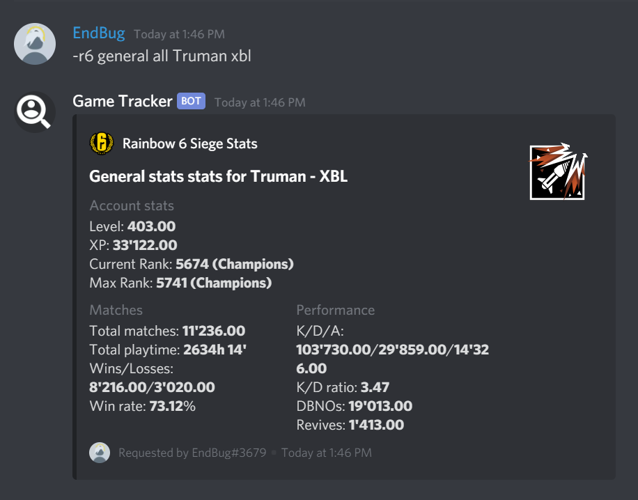
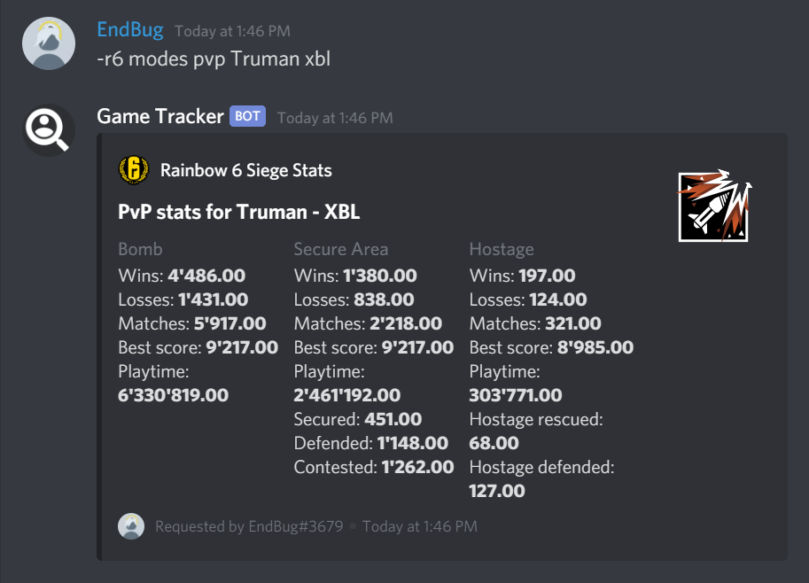
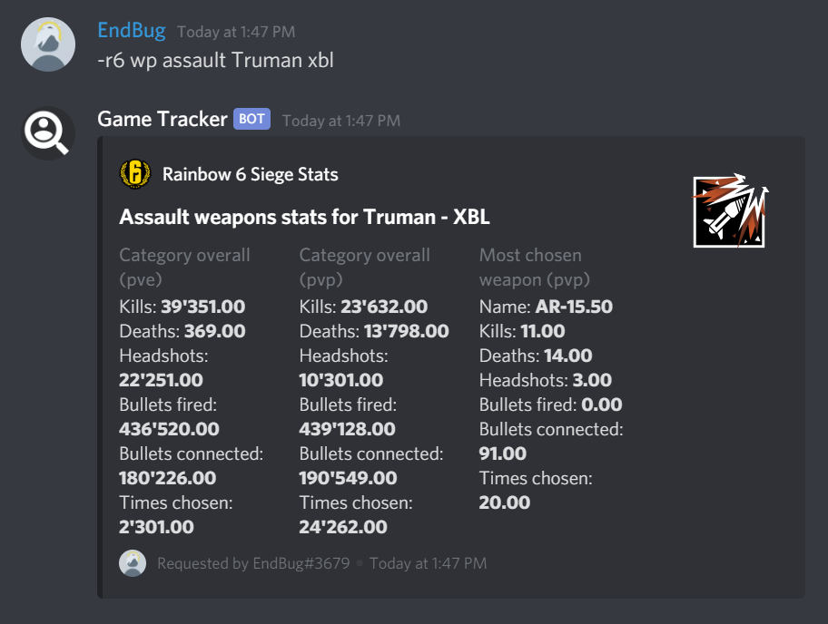
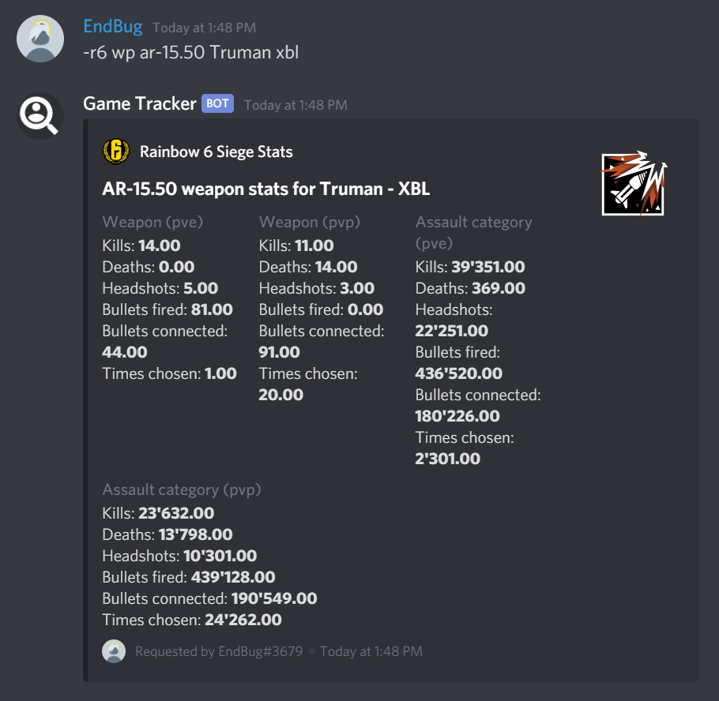
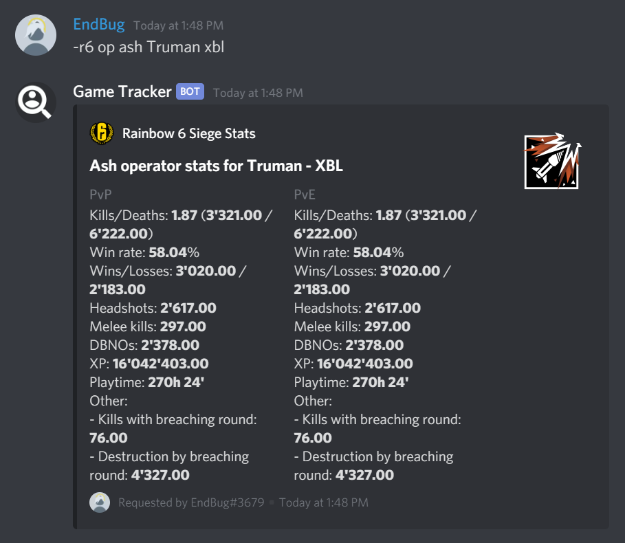
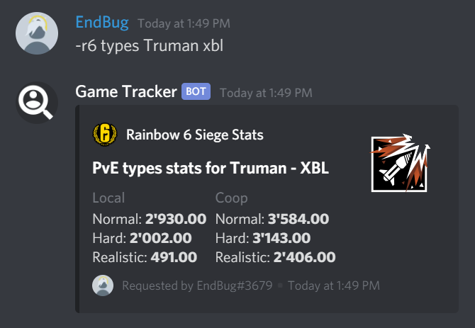
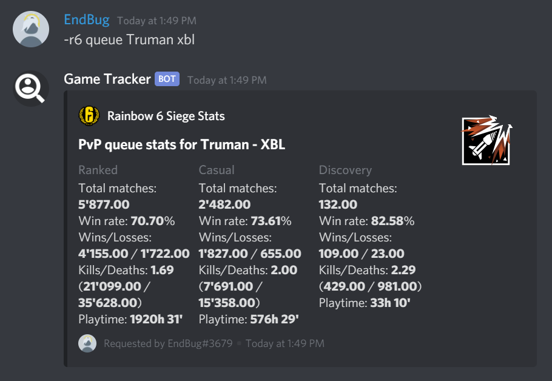

# Rainbow Six Siege
!> ⚠️ This module is temporarily disabled because of the issue with the UBI API, look [here](/r6/hold) for more info.

The Rainbow Six Siege commands let you look up players from every platform and get their stats.

## Format guide
`<>` is for mandatory, `[]` is for optional, `{}` is for mandatory if not linked.

### Custom definitions
* `username` → the username of the player you're looking up. If the user you want to look up has [linked](#r6-link) their account you can replace this with a Discord `@mention`. If you [linked](#r6-link) your account and you want to see your stats leave this blank, the bot will automatically use your linked account.
* `platform` → the platform the account belongs to; it could be either `uplay` (for pc), `xbl` or `psn`. If you leave this blank, the bot will automatically use `uplay` as the default. If you use a linked profile, whether for another user or yourself, you can leave this blank.
* `weaponName`, `weaponType` and `operator` → these are names of weapons, weapon categories and operators: you can find a the acceptable names in this [cheat sheet](/r6/r6_names).
* `playType`: either `pvp` or `pve`. If you see `playType | all` that means that you can also use `all`, and it will show stats for both play types.

## Commands

### `r6 general`

_Displays general stats for the given play types._  

> Format: `r6 general <playType | all> {account} [platform]`

To specify the player, enter their username and platform. You can also mention them and, if they linked their account to this bot, it will display their stats. If left blank, the bot will try to show your profile (if you [linked](#r6-link) it).

Examples:  
* `r6 general all BandltlsMyMaln` → Displays general PvP and PvE stats for `BandltlsMyMaln` by searching the user in the `uplay` category.
* `r6 general pvp Truman xbl` → Displays general PvP stats for `Truman` by searching the user in the `xbl` category.
* `r6 general all @DiscordUser` → Displays general PvP and PvE stats for the mentioned user, if they linked their account.
* `r6 general all` → Displays your general PvP and PvE stats, if you linked your account.

📷 Image (click here to show)
  

### `r6 modes`

_Displays modes stats for the given play type._  

> Format: `r6 modes <playType> {account} [platform]`

To specify the player, enter their username and platform. You can also mention them and, if they linked their account to this bot, it will display their stats. If left blank, the bot will try to show your profile (if you [linked](#r6-link) it).

Examples:  
* `r6 modes pvp BandltlsMyMaln` → Displays PvP stats for `BandltlsMyMaln` by searching the user in the `uplay` category.
* `r6 modes pvp Truman xbl` → Displays PvE stats for `Truman` by searching the user in the `xbl` category.
* `r6 modes pvp @DiscordUser` → Displays PvP stats for the mentioned user, if they linked their account.
* `r6 modes pve` → Displays your PvE stats, if you linked your account.

📷 Image (click here to show)
  

### `r6 wp`

_Displays weapon stats for the given weapon or weapon category._  

> Format: `r6 wp <weaponName | weaponType> {account} [platform]`

To specify the player, enter their username and platform. You can also mention them and, if they linked their account to this bot, it will display their stats. If left blank, the bot will try to show your profile (if you [linked](#r6-link) it).  
Specify the weapon to show by writing its name. Every weapon name or category can be written in lowercase and with `-` instead of spaces, e.g.: `"Super Shorty" = "super-shorty"`.  
You can find codes for supported weapons and weapon types [here](/r6/r6_names#weapon-categories).

Examples:  
* `r6 wp camrs BandltlsMyMaln` → Displays CAMRS stats for `BandltlsMyMaln` by searching the user in the `uplay` category.
* `r6 wp assault Truman xbl` → Displays assault weapons stats for `Truman` by searching the user in the `xbl` category.
* `r6 wp L85A2 @DiscordUser` → Displays L85A2 stats for the mentioned user, if they linked their account.
* `r6 wp pistol` → Displays your pistol weapons stats, if you linked your account.

📷 Image (click here to show)
  

### `r6 op`

_Displays operator stats for the given operator._  

> Format: `r6 op <operator> {account} [platform]`

To specify the player, enter their username and platform. You can also mention them and, if they linked their account to this bot, it will display their stats. If left blank, the bot will try to show your profile (if you [linked](#r6-link) it).  
Specify the operator to show by writing their name. Every operator can be written in lowercase with no spaces or dots, e.g.: `"Recruit SAS" = "recruitsas"`.  
You can find codes for supported operators [here](/r6/r6_names#operators).

Examples:  
* `r6 op recruitsas BandltlsMyMaln` → Displays Recruit SAS stats for `BandltlsMyMaln` by searching the user in the `uplay` category.
* `r6 op gridlock Truman xbl` → Displays Gridlock stats for `Truman` by searching the user in the `xbl` category.
* `r6 op nokk @DiscordUser` → Displays Nøkk stats for the mentioned user, if they linked their account.
* `r6 op frost` → Displays your Frost stats, if you linked your account.

📷 Image (click here to show)
  

### `r6 types`

_Displays types stats for the given player._  

> Format: `r6 types {account} [platform]`

To specify the player, enter their username and platform. You can also mention them and, if they linked their account to this bot, it will display their stats. If left blank, the bot will try to show your profile (if you [linked](#r6-link) it).  

Examples:  
* `r6 types BandltlsMyMaln` → Displays types stats for `BandltlsMyMaln` by searching the user in the `uplay` category.
* `r6 types Truman xbl` → Displays types stats for `Truman` by searching the user in the `xbl` category.
* `r6 types @DiscordUser` → Displays types stats for the mentioned user, if they linked their account.
* `r6 types` → Displays your types stats, if you linked your account.

📷 Image (click here to show)
  

### `r6 queue`

_Displays queue stats for the given player._  

> Format: `r6 queue {account} [platform]`

To specify the player, enter their username and platform. You can also mention them and, if they linked their account to this bot, it will display their stats. If left blank, the bot will try to show your profile (if you [linked](#r6-link) it).  

Examples:  
* `r6 queue BandltlsMyMaln` → Displays queue stats for `BandltlsMyMaln` by searching the user in the `uplay` category.
* `r6 queue Truman xbl` → Displays queue stats for `Truman` by searching the user in the `xbl` category.
* `r6 queue @DiscordUser` → Displays queue stats for the mentioned user, if they linked their account.
* `r6 queue` → Displays your queue stats, if you linked your account.

📷 Image (click here to show)
  

### `r6 link`

_Saves your account in the bot's database._  

> Format: `r6 link {account} [platform]`

You just need to enter your username; if you are playing on Xbox or PlayStation, add the platform after it (the default one is `uplay`)

Examples:  
* `r6 link BandltlsMyMaln` → Links `BandltlsMyMaln` by searching the user in the `uplay` category.
* `r6 link Truman xbl` → Links `Truman` by searching the user in the `xbl` category.
* `r6 link` → Displays your current linked account.

### `r6 unlink`

_Deletes your account from the bot's database._  

> Format: `r6 unlink`

Example:  
* `r6 unlink` → Unlinks your account.

## Any questions?

If you have further doubts or questions you can ask in the [Game Tracker Support Guild](https://discord.gg/ZhnWkqc).
